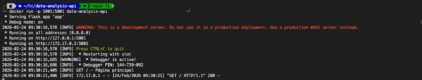
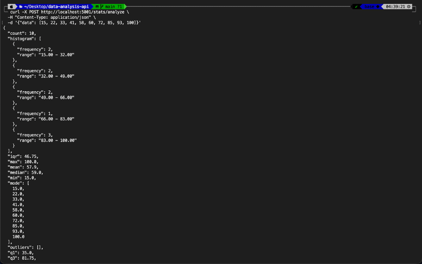
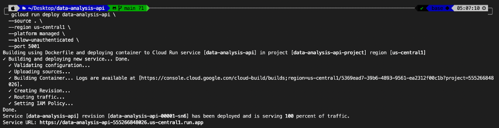

# Data Analysis API

API REST para análisis estadístico de datos numéricos, desarrollada con Flask y NumPy.

## Descripción

Esta API recibe datasets numéricos y devuelve análisis estadísticos completos incluyendo medidas de tendencia central, dispersión, detección de valores atípicos (outliers), histogramas de frecuencia y un sistema de scoring de calidad de datos.

## Tecnologías

- Python 3.11
- Flask
- NumPy
- Docker
- Google Cloud Run

## Instalación local
```bash
python3 -m venv venv
source venv/bin/activate
pip install -r requirements.txt
python app.py
```

El servidor estará disponible en `http://localhost:5001`

## Endpoints

### GET /
Información general del API.

### GET /stats/summary
Retorna el último análisis realizado.

### POST /stats/analyze
Recibe una lista de números y retorna análisis estadístico completo.

**Body (JSON):**
```json
{
  "data": [10, 20, 30, 40, 50, 60, 70, 80, 90, 100]
}
```

**Respuesta incluye:** media, mediana, moda, desviación estándar, varianza, rango, cuartiles, detección de outliers (IQR) e histograma de frecuencias.

### POST /stats/score
Evalúa la calidad de un dataset mediante un sistema de scoring (0-100).

**Body (JSON):**
```json
{
  "data": [15, 22, 33, 41, 58, 60, 72, 85, 93, 100]
}
```

**Criterios de evaluación:** tamaño de muestra, coeficiente de variación, porcentaje de outliers.

## Docker
```bash
docker build -t data-analysis-api .
docker run -p 5001:5001 data-analysis-api
```

## Pruebas con curl
```bash
# GET raíz
curl http://localhost:5001/

# POST análisis
curl -X POST http://localhost:5001/stats/analyze \
  -H "Content-Type: application/json" \
  -d '{"data": [10, 20, 30, 40, 50]}'

# POST scoring
curl -X POST http://localhost:5001/stats/score \
  -H "Content-Type: application/json" \
  -d '{"data": [10, 20, 30, 40, 50]}'

# Validación de errores
curl -X POST http://localhost:5001/stats/analyze \
  -H "Content-Type: application/json" \
  -d '{"data": []}'
```

## Despliegue en la nube

La API está desplegada en Google Cloud Run y es accesible públicamente en:

🔗 https://data-analysis-api-555266848026.us-central1.run.app

## Evidencias

### API funcionando localmente


### Construcción de imagen Docker


### Contenedor ejecutándose


### Prueba curl GET


### Prueba curl POST


### Manejo de errores


### Despliegue en Google Cloud


### Endpoint accesible públicamente


## Branching

Se utilizó la branch `feature/scoring` para desarrollar el sistema de scoring de datasets, la cual fue mergeada a `main`.