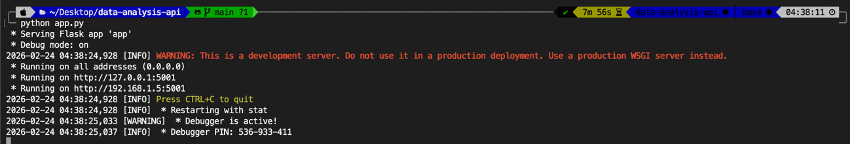
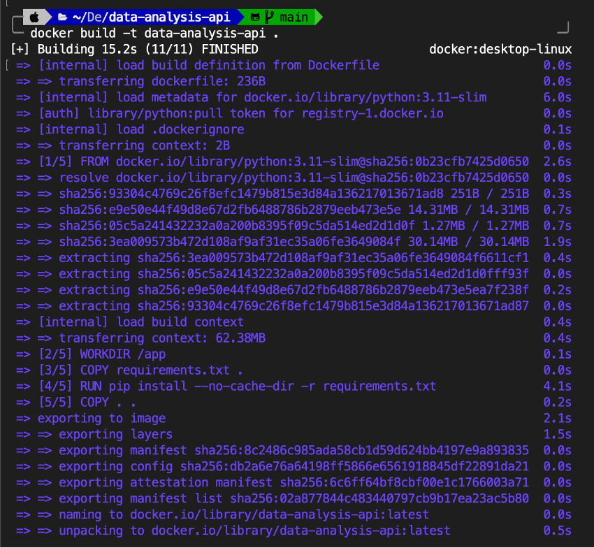
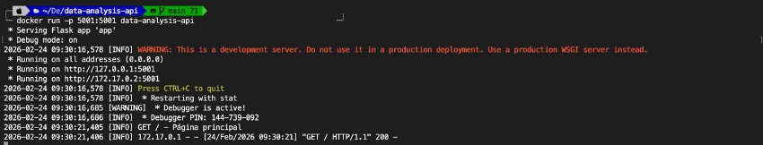
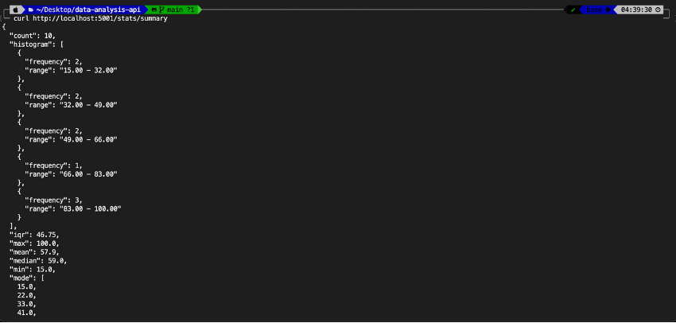
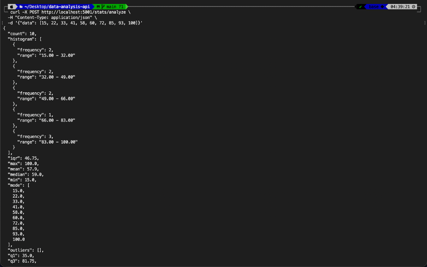
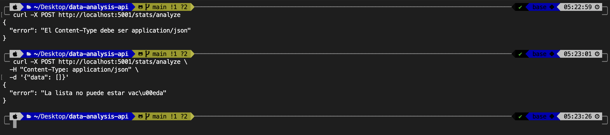
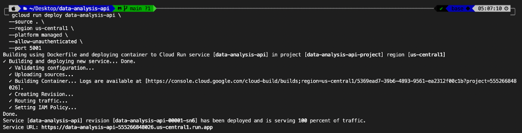
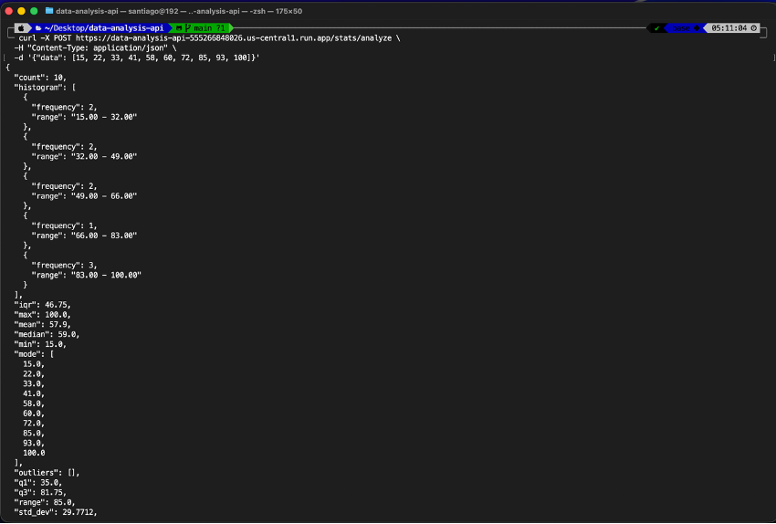

# Data Analysis API

API REST para análisis estadístico de datos numéricos, desarrollada con Flask y NumPy.

## Descripción

Esta API recibe datasets numéricos y devuelve análisis estadísticos completos incluyendo medidas de tendencia central, dispersión, detección de valores atípicos (outliers), histogramas de frecuencia y un sistema de scoring de calidad de datos.

## Tecnologías

- Python 3.11
- Flask
- NumPy
- Docker
- Google Cloud Run

## Instalación local
```bash
python3 -m venv venv
source venv/bin/activate
pip install -r requirements.txt
python app.py
```

El servidor estará disponible en `http://localhost:5001`

## Endpoints

### GET /
Información general del API.

### GET /stats/summary
Retorna el último análisis realizado.

### POST /stats/analyze
Recibe una lista de números y retorna análisis estadístico completo.

**Body (JSON):**
```json
{
  "data": [10, 20, 30, 40, 50, 60, 70, 80, 90, 100]
}
```

**Respuesta incluye:** media, mediana, moda, desviación estándar, varianza, rango, cuartiles, detección de outliers (IQR) e histograma de frecuencias.

### POST /stats/score
Evalúa la calidad de un dataset mediante un sistema de scoring (0-100).

**Body (JSON):**
```json
{
  "data": [15, 22, 33, 41, 58, 60, 72, 85, 93, 100]
}
```

**Criterios de evaluación:** tamaño de muestra, coeficiente de variación, porcentaje de outliers.

## Docker
```bash
docker build -t data-analysis-api .
docker run -p 5001:5001 data-analysis-api
```

## Pruebas con curl
```bash
# GET raíz
curl http://localhost:5001/

# POST análisis
curl -X POST http://localhost:5001/stats/analyze \
  -H "Content-Type: application/json" \
  -d '{"data": [10, 20, 30, 40, 50]}'

# POST scoring
curl -X POST http://localhost:5001/stats/score \
  -H "Content-Type: application/json" \
  -d '{"data": [10, 20, 30, 40, 50]}'

# Validación de errores
curl -X POST http://localhost:5001/stats/analyze \
  -H "Content-Type: application/json" \
  -d '{"data": []}'
```

## Despliegue en la nube

La API está desplegada en Google Cloud Run y es accesible públicamente en:

🔗 https://data-analysis-api-555266848026.us-central1.run.app

## Evidencias

### API funcionando localmente


### Construcción de imagen Docker


### Contenedor ejecutándose


### Prueba curl GET


### Prueba curl POST


### Manejo de errores


### Despliegue en Google Cloud


### Endpoint accesible públicamente


## Branching

Se utilizó la branch `feature/scoring` para desarrollar el sistema de scoring de datasets, la cual fue mergeada a `main`.

## Preguntas

### a) ¿Cómo podrían generar y devolver gráficos de los análisis que hacen (por ejemplo boxplot)?
Actualmente la API devuelve únicamente resultados estadísticos en formato JSON, incluyendo medidas de tendencia central, dispersión, detección de outliers y un histograma de frecuencias. Sin embargo, para enriquecer el análisis y facilitar la interpretación visual de los datos, se podría extender la API para generar gráficos como boxplots, histogramas o distribuciones.
Una forma de implementar esto sería integrando librerías de visualización en el backend, como Matplotlib, Seaborn o Plotly. Estas librerías permitirían generar gráficos directamente a partir del dataset recibido en el endpoint de análisis.
El flujo de implementación sería el siguiente:
El endpoint recibe el dataset.
Se calculan las estadísticas como se hace actualmente.
Se genera el gráfico (por ejemplo un boxplot) utilizando una librería de visualización.
El gráfico se exporta como imagen (PNG o SVG).
Existen dos formas principales de devolver el gráfico al cliente:
Incrustado en la respuesta JSON, codificado en Base64.
Almacenado en un servicio de almacenamiento (por ejemplo Google Cloud Storage o AWS S3) y devolver únicamente la URL del recurso.
Otra  forma  de  realizarlo seria utilizando lenguajes de programación o herramientas de análisis de datos que permiten visualizar la información. Algunas formas comunes son: 
## 1. Usando Python 
Con bibliotecas como Matplotlib o Seaborn, se pueden crear gráficos fácilmente. 
Ejemplo de boxplot en Python: 
import matplotlib.pyplot as plt 
datos = [10, 12, 15, 20, 22, 23, 25, 30] 
plt.boxplot(datos) 
plt.title("Boxplot de los datos") 
plt.show() 
Esto genera un boxplot que muestra: 
A. mediana 
B. cuartiles 
C. valores atípicos (outliers) 
## 2. Usando R 
El lenguaje R también es muy utilizado para análisis estadístico. 
Ejemplo: 
datos <- c(10,12,15,20,22,23,25,30) 
boxplot(datos, main="Boxplot de los datos") 
3. Con herramientas de análisis visual 
También se pueden generar gráficos con plataformas como: 
• Microsoft Excel 
• Tableau 
• Power BI 
Estas herramientas permiten crear gráficos automáticamente a partir de los datos. 
Conclusión: 
Los gráficos como boxplots se generan utilizando herramientas de análisis (Python, R o 
software de visualización) que procesan los datos y devuelven representaciones visuales 
para facilitar la interpretación.

### b) Uno de sus endpoints revisa si ya no realizó ese análisis previamente, ¿cómo lo implementarían en producción? ¿Sería por usuario y cómo lo lograrían?

En la implementación actual, el endpoint `/stats/summary` devuelve únicamente el último análisis realizado utilizando una **variable global en memoria**. Este enfoque funciona en un entorno local o de desarrollo, pero no es adecuado para producción, ya que:

- Los datos se pierden si el servicio se reinicia.
- No funciona correctamente cuando existen múltiples instancias del servicio.
- No permite diferenciar análisis por usuario.

En un entorno de producción se debería utilizar una **base de datos o sistema de cache distribuido**, como por ejemplo:

- PostgreSQL  
- Redis  
- Firestore  
- O cualquier base de datos gestionada en la nube.

Una estrategia común consiste en identificar cada análisis mediante un **hash del dataset**.

#### Proceso de implementación

1. Cuando el usuario envía un dataset, se genera un **hash del contenido** (por ejemplo utilizando SHA-256).
2. Se consulta en la base de datos si ya existe un análisis previo con ese hash para el mismo usuario.
3. Si el análisis existe, se devuelve el resultado almacenado.
4. Si no existe, se ejecuta el análisis estadístico, se guarda el resultado y luego se devuelve al cliente.

Esto permite evitar cálculos redundantes y mejorar el rendimiento del sistema.

#### Estructura de datos sugerida

La base de datos podría almacenar campos como:

- `user_id`
- `dataset_hash`
- `analysis_result`
- `created_at`

El `user_id` podría obtenerse mediante mecanismos de autenticación comunes como:

- API Keys
- JWT tokens
- Sesiones autenticadas

Esto permite manejar análisis independientes para cada usuario de la API.

---

### Implementación práctica en producción

En producción sí se suele verificar si un usuario ya ejecutó previamente un análisis, especialmente para:

- Evitar cálculos duplicados
- Ahorrar recursos
- Mejorar la velocidad de respuesta

Esto normalmente se implementa **por usuario y por tipo de análisis**.

#### 1. Identificar al usuario

Primero el sistema debe saber qué usuario realiza la solicitud. Esto normalmente se hace mediante:

- Autenticación con token (JWT)
- ID de usuario en la base de datos
- Sesiones

Ejemplo de datos que podría recibir el endpoint:

```json
{
  "user_id": 25,
  "analysis_type": "boxplot",
  "dataset_id": 10
}

